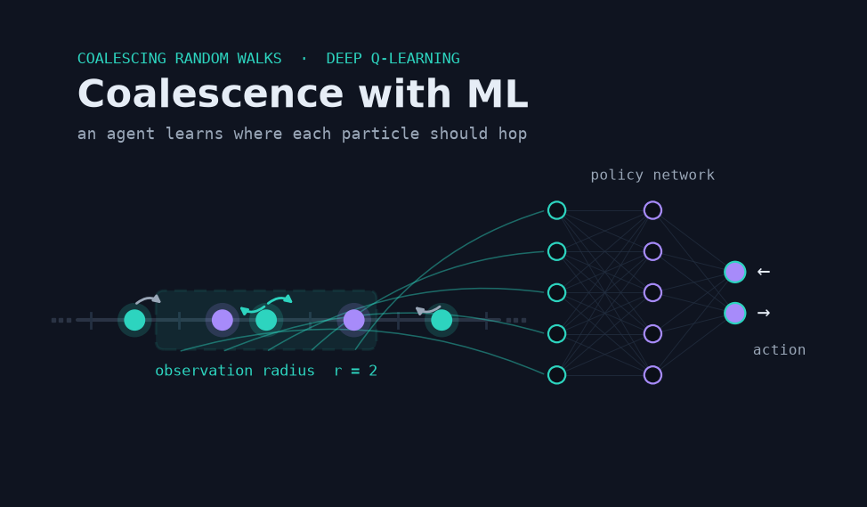
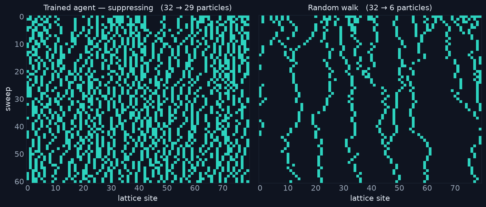
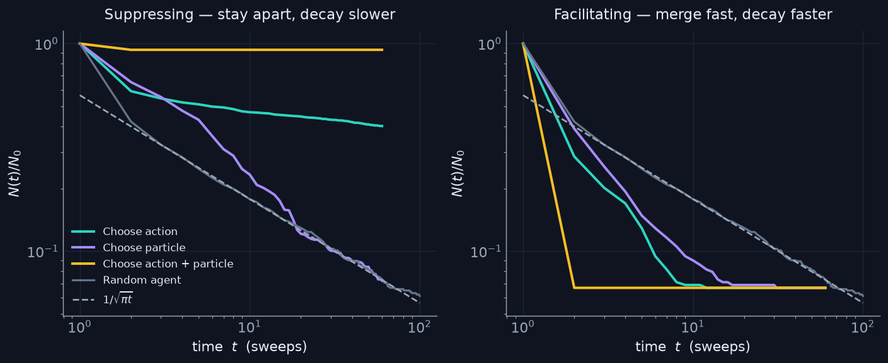
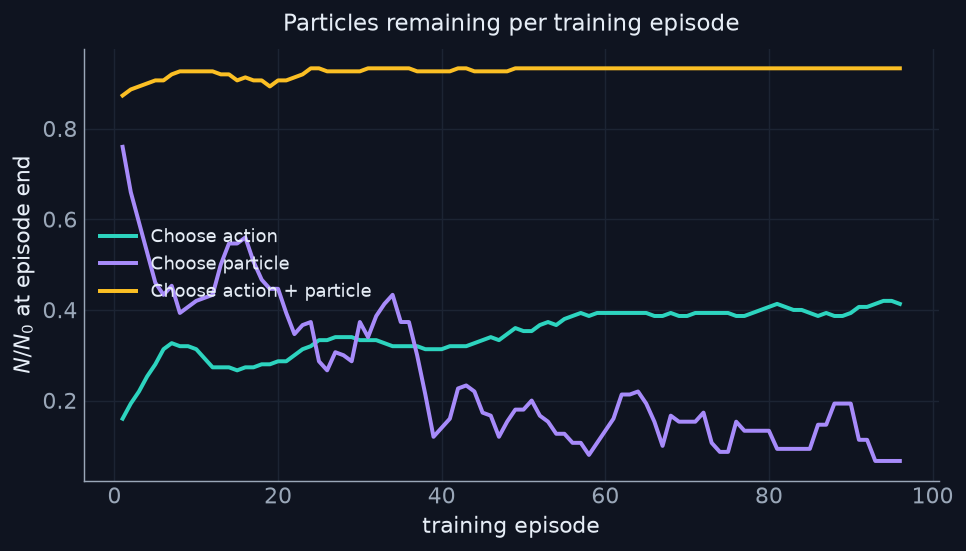
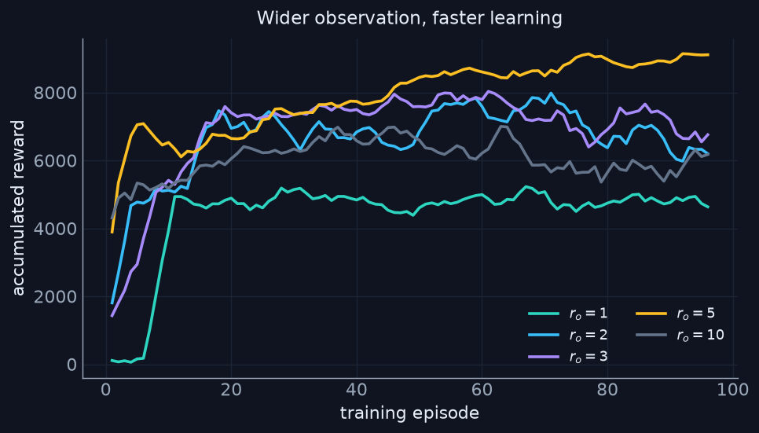
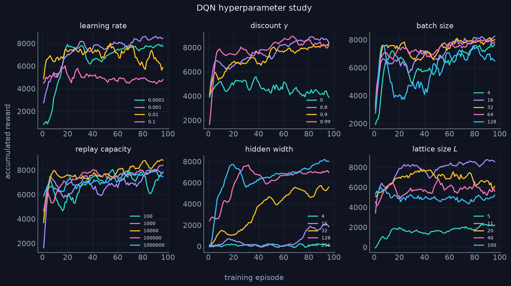

# Coalescence with ML

Teaching a reinforcement-learning agent to **steer coalescing random walks** —
either holding particles apart so they decay slower than physics says they
should, or herding them together so they decay faster. This was my bachelor's
thesis, here cleaned up into a small, reproducible package.



## The idea

Put `N` particles on a 1D ring of `L` sites and let them hop left and right at
random. When two land on the same site they merge into one (A + A → A). Left
alone this is a classic statistical-mechanics system: the density decays as

```
N(t) / N0  ~  1 / sqrt(pi * t)
```

That `1/sqrt(pi t)` curve is the baseline every figure here is measured against.
The question I asked: *if an agent gets to influence the walk, how far can it
bend that curve?* Two opposite goals —

- **Suppress** coalescence: keep particles apart, decay *slower* than baseline.
- **Facilitate** coalescence: drive particles together, decay *faster*.

I trained a Deep Q-Network for each goal and let the reward do the rest.



The clearest way to see it: each row above is one sweep and bright cells are
particles. Under the trained suppressing agent (left) the particles stay
numerous and spread out; under a plain random walk (right) they coalesce into a
handful of thinning trajectories.

## Three ways to hand the agent control

The interesting design question is *what the agent sees and what it acts on*. I
tried three formulations of the same problem:

| Formulation | Observation | Action |
| --- | --- | --- |
| **Choose action** | a window of radius `r` around one particle | move that particle left / right |
| **Choose particle** | the whole lattice | pick *which* particle moves (it then steps randomly) |
| **Choose action + particle** | the whole lattice | pick a particle *and* its direction |

They share the same lattice physics and the same DQN — only the observation and
action spaces change. That's the whole `envs.py`: a common base class plus three
small subclasses.

## Results: bending the curve both ways



On the left the agents **suppress**: the density sits *above* the `1/sqrt(pi t)`
line and the random agent, sometimes dramatically — the full-control agent
("choose action + particle") barely lets any particles merge at all. On the
right the same machinery, rewarded the other way, **facilitates**: the curves
drop *below* baseline and the particles coalesce well ahead of schedule.

The more control the agent has, the harder it can push — full control over both
*which* particle moves and *where* gives the cleanest separation from the
baseline in both directions.

## Does it actually learn?



Tracking the fraction of particles left at the end of each training episode (for
the suppression task, higher is better): the **choose-action + particle** agent
climbs to near-perfect suppression, **choose-action** settles into a solid
policy, and the pure **choose-particle** agent is the unstable one — picking a
particle without controlling its direction is a much noisier signal to learn
from. Same finding shows up in the comparison figure above.

## How much does the agent need to see?



For the local "choose action" agent, the observation radius `r` is the one knob
that decides how much of the lattice it can sense. Evaluating the trained agents
on a large lattice, a wider window holds more particles apart: `r = 5` suppresses
the most, and all three radii sit well above the random walk and the
`1/sqrt(pi t)` baseline (which overlap at the bottom).

## The hyperparameter study



Standard DQN tuning, swept one knob at a time: learning rate, discount, batch
size, replay-buffer capacity, hidden-layer width, and lattice size. Nothing
exotic — but it's what made training stable enough to compare the three
formulations fairly.

## Running it

```bash
pip install -e .                # install the `coalescence` package
python make_figures.py          # regenerate every figure from results/  (no training)
python -m coalescence.train --config configs/suppress_local_action.yaml
```

The figures rebuild straight from the saved `.txt` results, so you can reproduce
the whole story without training anything. To retrain, point `coalescence.train`
at any config in `configs/`.

```python
from coalescence import make_env, DQNAgent

env = make_env("global_particle", length=50, n_particles=50)   # suppress task
agent = DQNAgent(env)
agent.load("models/global_particle_suppress_L50.pth")          # a trained agent
```

## What's here

| Path | What it is |
| --- | --- |
| `src/coalescence/envs.py` | the coalescing-random-walk lattice + three control formulations |
| `src/coalescence/agent.py` | DQN, replay buffer, epsilon-greedy agent (one implementation) |
| `src/coalescence/train.py` | a single config-driven training loop |
| `src/coalescence/evaluate.py` | density rollouts, coalescence time, random + theory baselines |
| `configs/` | one YAML per experiment (variant × suppress/facilitate) |
| `results/` | the curated thesis data the figures are built from |
| `models/` | a handful of trained networks, one per formulation and goal |
| `make_figures.py` | regenerates all figures from `results/` |

## Notes

- The lattice mechanics, reward magnitudes, and trained networks are exactly the
  ones from the thesis — this repo is a cleanup, not a re-run. The original was
  three copy-pasted code folders; here it's one package with the duplication
  removed.
- The trained networks load straight into the refactored agent and reproduce the
  thesis behaviour, which doubled as a regression test while I was restructuring.
- `1/sqrt(pi t)` is the diffusion-limited asymptote for coalescing random walks
  in one dimension; it's the honest baseline for "doing nothing".
